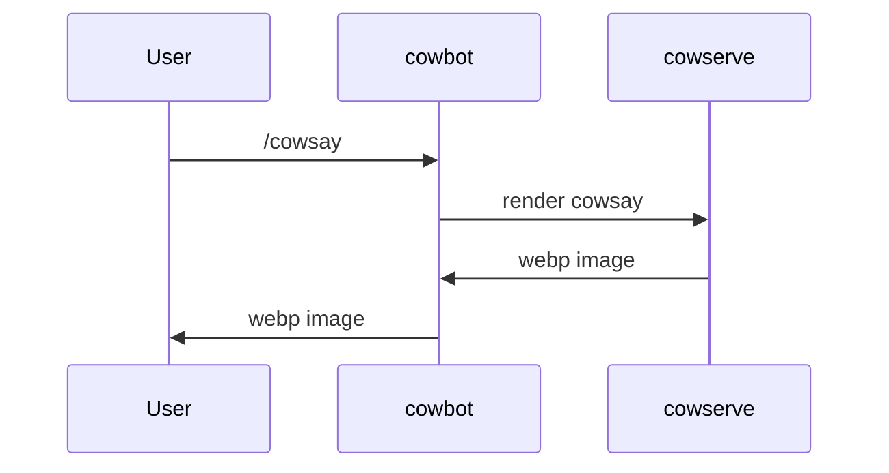
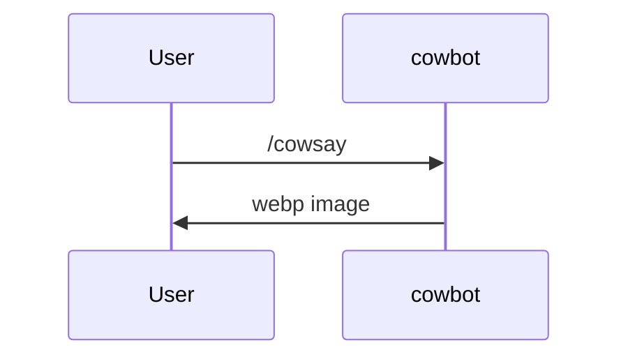

Here is a breakdown of each project directory and their responsibilities

 - /cowbot Interacts with Discord and cowserve to serve cowsay images.
 - /cowserve The logic for rendering and storing cowfiles
 - /cowparse The logic behind rendering and parsing cowfiles
 - /cowsite Just the website for this project 

By default, cowbot requires there to be an instance of cowserve running, but
There is a `standalone` mode that allows you to make changes to cowparse/cowbot
without having to run cowserve.



### Standalone



# Setup

 - [Visual Studio Code](https://code.visualstudio.com/) is recommended
 - [Docker](https://www.docker.com/) is necessary

When opening this repository in Visual Studio Code, it will recommend installing
the dev-containers extension. Once installed, you can then reopen this
folder in a dev container.

Every topic discussed after this point is an assumption that you have this 
project open in a dev container or have your own personal dev environment
requirements set up.

# Contributing to Cowbot

There are two ways to launch cowbot: with cowserve or in standalone. If 
You're making a small change to how the bot operates or cowparse, then standalone
should work for you.

## Standalone

Make sure to copy the .env.example into a `.env` file at the root of cowsay
(neighboring) the .env.example. 

 - Set the bot token to a Discord bot you have set up (no gateway intentions required).
 - Set the dev_server_id to the server you will be testing in.

Then, to start, type this in a terminal within the cowbot directory.

```sh
bash scripts/dev.sh standalone
```

# Contributing to Cowserve

Cowserve acts as the core functionality and backend for cowsay. It communicates with cowbot and cowsite
to serve renders. It requires the following external services to be running.

 - Postgres 15
 - (optional) RabbitMQ
 - (optional) cowserve consume mode

These services can be spun up using the docker-compose.yml file.

```sh
docker compose up postgres queue
```

Then configure the .env at the root of the project, and while in the cowserve directory, run 
the following script:

```sh
bash scripts/dev.sh
```

## Cowserve Consume

This will act as a worker for the queue server.

```sh
bash scripts/dev.sh consume
```

# Contributing to Cowsite

WIP
