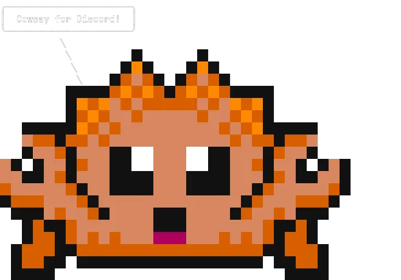

<div align="middle" float="left">

   

  <br>

 <a href="https://github.com/dylhack/cowsay-bot/actions/workflows/release.yml">
  
 </a>

  <br>

  <a href="https://discord.gg/NjSg2U6R">
    
  </a>

  <br>

 <a href="https://discord.com/api/oauth2/authorize?client_id=1135038990081347605&permissions=0&scope=applications.commands%20bot">
   
 </a>
</div>

# Setup

Docker is recommended for setup.

```sh
docker run -d -e BOT_TOKEN=token ghcr.io/dylhack/cowsay-bot:latest
```

## Without Docker

You can use this setup also for development. If you plan on developing make 
sure to set the `DEV_SERVER_ID` in the `.env`.

**Requirements**

 - [Rust](https://www.rust-lang.org/)

```sh
git clone https://github.com/dylhack/cowsay-bot
cd cowsay-bot
cp .env.example .env
# Make sure to set the BOT_TOKEN before running
cargo run
```
